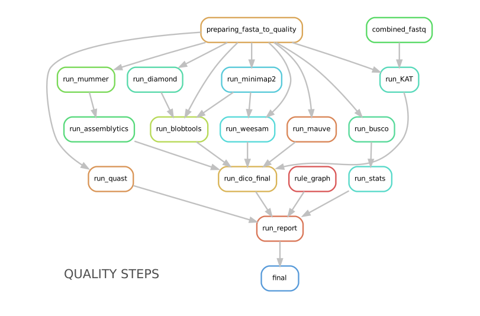

## Table of Contents
<!-- TOC depthFrom:2 depthTo:3 withLinks:1 updateOnSave:1 orderedList:0 -->
- [About this package](#about-this-package)
- [Installation](#installation)
- [Rules in CulebrONT](#rules)
- [Running CulebrONT](#running-culebront)
- [Parameters](#Parameters)
- [Singularity images](#singularity)
- [Cluster_config.yaml](#prepclusteryaml)
- [Launching CulebrONT on Slurm HPC clusters](#sbatch)
- [Output of CulebrONT](#output)
- [Citation](#citation)
- [Useful notes](#notes)
- [License](#license)
<!-- /TOC -->

<a name="about-this-package"></a>
## About this package

Using data from long reads obtained by Oxford Nanopore Technologies sequencing makes genome assembly easier, in particular to solve repeats and structural variants, in prokaryotic as well as in eukaryotic genomes, resulting in increased contiguity and accuracy.

Bunch of softwares and tools are released or updated every week, and a lot of species see their genome assembled using those.

That’s right.

"*But which assembly tool could give the best results for my favorite organism?*"

**CulebrONT can help you!** CulebrONT is an open-source, scalable, modulable and traceable snakemake pipeline, able to launch multiple assembly tools in parallel and providing help for choosing the best possible assembly between all possibilities.

<a name="installation"></a>
## Installation

### Mandatory installation

CulebrONT uses Python >= 3.7 and Snakemake >= 5.10.0. Singularity 3.0.0+ could be of help (see [below](#singularity))


* Install or update CulebrONT

``` bash
git clone https://github.com/SouthGreenPlatform/CulebrONT_pipeline.git
cd CulebrONT_pipeline
```

### Optional Installation

To obtain a clear and correct report, please add also the following dependencies from R:
 * `devtools::install_github("strengejacke/strengejacke")`
 * 'plotly', 'dplyr', 'optparse', 'htmltools', 'rmdformats', 'magrittr', 'yaml', 'png', 'here', 'htmlwidgets'.

<a name="rules"></a>
## Rules in Culebront

Assembly, circularisation, polishing and correction steps are included in CulebrONT, and can be activated (or not) according to user’s requests. The most commonly used tools in the community for each step are integrated, as well as various quality control tools. CulebrONT also generates a report compiling information obtained at every step.

### From assembly to correction

CulebrONT is really flexible to assembly and circularise (or not) assembled molecules, polish and correct assemblies.

For assemblies, you must launch at least one of assemblers included in CulebrONT and pipe assembly with circularisation, polishing and correction steps as well as with the quality control pipeline.

For circularisation, you can activate/deactivate circularisation steps if needed.
If you are interested on eukaryotic organims, thus circularisation is not necessary use CIRCULAR=False on *config.yaml* file.

Directed acyclic graphs (DAGs) show the differences between deactivated (left) and activated (right) CIRCULAR step on configuration file.


##### Assembly
CulebrONT includes (at the moment) three recent and community-validated assemblers : Flye, Miniasm and Canu. More will be added in the future.

Included tools :
* Flye version >= 2.6 https://github.com/fenderglass/Flye
* Canu version >= 1.9 https://canu.readthedocs.io/en/latest/quick-start.html
* Miniasm version >= 0.3 https://github.com/lh3/miniasm + Minipolish version >= 0.1.2 https://github.com/rrwick/Minipolish

##### Circularisation

If an assembled molecule is circular, e.g. for bacteria (CIRCULAR=True), this molecule is tagged and will be treated specially in pipeline. We implemented tagging and rotation of circular molecule before each racon polishing step, and we fixing start position on circular genome. This is efficient when multiple genome alignments are envisaged.  

* If Circularisation (CIRCULAR=True) step is choosen, the *--plasmids* option on Flye is activated.
* *Ciclator* is used to circularise assembly from Canu. Circlator will attempt to identify each circular sequence and output a linearised version from each of them.
* Circularisation for Miniasm is already performed by minipolish.

Included tools :
* Circlator version >= 1.5.5 https://github.com/sanger-pathogens/circlator

##### Polishing
Polishing step is ensured by Racon. Racon corrects raw contigs generated by rapid assembly methods with original ONT reads. Choose how many rounds of Racon you want to perform (constrains from 1 to 9 rounds), and CulebrONT will recursively do it for you. Generally 3 or 4 iterations are the best choices.

Included tools :
* Racon version >= 1.4.3 https://github.com/isovic/racon

##### Correction
Correction can improve the consensus sequence for a draft genome assembly. We include Nanopolish and Medaka on correction steps. With CulebrONT you can now train a Medaka model and use it directly to obtain a consensus from you favorite organism. In addition, Medaka can use a dedicated GPU resource if indicated.

Included tools :s
* Medaka Medaka-gpu version >= 1.0.3 https://github.com/nanoporetech/medaka
* Nanopolish version >= 0.11.3 https://nanopolish.readthedocs.io/en/latest/index.html#

### Checking assembly quality

A variety of useful tools exist for check high accuracy assembly.



##### Mandatory Quality tools
 In CulebrONT, BUSCO and QUAST are selected by default. BUSCO helps to check if you have a good assembly, by searching the expected single-copy lineage-conserved orthologs in any newly-sequenced genome from an appropriate phylogenetic clade. QUAST is a good starting point to help evaluate the quality of assemblies, providing many helpful contiguity statistics. BUSCO and QUAST statistics are summarized in the CulebrONT final report.

* BUSCO and QUAST statistics will be calculated by acivaiting the QUALITY (ASSEMBLY, POLISHING, CORRECTION) steps. You must activate at least one over three QUALITY options on *config.yaml* file.

Included tools :
* BUSCO version >= 4.0.5
* QUAST version >= 5.0.2

##### Optional Quality tools

CulebrONT checks also the quality of assemblies by using Bloobtools, Assemblytics or KAT, or any combination of these. Weesam can be also used to check read coverage over you assembly (for small genome only). Alignment of several assembles (or from any steps : assembly, polishing, correction) and there comparison is performed using Mauve (for small genome only).

Included tools :  
* Bloobtools version >= 1.1.1
* Assemblytics version >= 1.2
* KAT version >= 2.4.1
* Weesam version > 1.6
* Mauve > 2.4.0.snapshot_2015_02_13

##### Report
CulebrONT generates a report presenting the summary statistics from different steps of the pipeline.

This report has different dependencies to be preinstalled, as recomanded in the [installation step](#installation)

Don't worry if you do not have access to all these depedencies !! The whole packages used in the report are available in  the *R.def* Singularity image, available at the Singularity hub or build from the [CulebrONT Containers repository](https://github.com/SouthGreenPlatform/CulebrONT_pipeline/tree/master/Containers) (only if you have sudo super cowpowers).

<a name="running-culebront"></a>
## Running CulebrONT

**For IRD iTrop or IFB HPC resources users ONLY**
``` bash
# On i-Trop HPC
module load system/singularity/3.3.0
module load system/python/3.7.2

# On IFB HPC
module load singularity
module load python/3.7
module load graphviz/2.40.
```

### Prepare config.yaml

To run the pipeline you have to provide the data path and activate/deactivate options in every step from config.yaml file.

##### 1. Providing data

First, indicate the data path in the configuration file

```yaml
DATA:
    FASTQ: '/path/to/fastq/directory/'
    REF: '/path/to/referencefile.fasta'
    GENOME_SIZE: '1m'
    FAST5: '/path/to/fast5/directory/'
    ILLUMINA: '/path/to/illumina/directory/'
    OUTPUT: '/path/to/output/directory/'
    CIRCULAR : True/False
```

* **FASTQ**: CulebrONT takes as input a FASTQ directory. Every FASTQ file should contain the whole set of reads to be assembled (meaning that multiple runs must be merged in a single FASTQ file), as each FASTQ file found in this repertory will be assembled independently. FASTQ files can be compressed or not (gzipped). Naming convention accepted by CulebrONT are: *NAME.fastq.gz* or *NAME.fq.gz* or *NAME.fastq* or *NAME.fq*.

* **REF**: Only one REFERENCE genome file will be used by CulebrONT. This REFERENCE will be used for QC steps (QUAST and MAUVE).

* **GENOME_SIZE** : Estimated genome size (m,g,k) of the assembly.

* **FAST5**: Nanopolish needs FAST5 files to training steps. Please give the path of FAST5 repertory in the *FAST5* DATA parameter. Inside this directory, a subdirectory with the exact same name as the corresponding FASTQ (before the *.fastq.gz*) is requested. For instance, if in the *FASTQ* directory we have *run1.fastq.gz* and *run2.fastq.gz*, CulebrONT is expecting the *run1/* and *run2/* subdirectories in the FAST5 main directory.   

* **ILLUMINA** : indicate the path to the directory with *Illumina* sequence data (in fastq or fastq.gz format) to perform KAT quality. Use preferentially paired-end data.

* **OUTPUT**: output *path* directory.

* **CIRCULAR** : Indicate *True* or *False* to activate/deactivate circularisation steps (only to procaryote).


##### 2. Chose assemblers, polisher and correctors

Activate/deactivate assemblers and correctors as you wish. By default, Racon is launched as POLISH tool after each activated assembly step. You **must** activate at least one assembler and one corrector.

Example:
```yaml
ASSEMBLY:
    CANU : False
    FLYE : True
    MINIASM : False
CORRECTION:
    NANOPOLISH : True
    MEDAKA : False
```

##### 3. Chose quality tools

Activate/deactivate quality tools as you wish. By default, BUSCO AND QUAST are launched if 'True' in QUALITY (ASSEMBLY OR POLISHING OR CORRECTION OR both) steps.

 You **must** to activate at least one QUALITY step.

 Example:

```yaml
QUALITY:
    ASSEMBLY : True
    POLISHING : True
    CORRECTION : True
```
Others quality tools are launched only on the *final assemblies* (BLOBTOOLS, ASSEMBLYTICS, WEESAM and KAT).

KAT quality tool can be activate but Illumina reads are mandatory in this case.

```yaml
#### Others quality tools
    WEESAM: True
    BLOBTOOLS: True
    ASSEMBLYTICS: True
    KAT: True
```

Alignment of various assemblies **for small genomes (<10-20Mbp)** is also possible by using Mauve. Mauve will compared each state of the assembly (Raw, Polished and Corrected) for each assembler used.

A *Fixstart* step is possible before Mauve MSA to improve alignment on circular molecules.
* Fixstart will be deactivated if CIRCULAR is False
* Only activate MAUVE if you have more than one sample and more than one quality step.

```yaml
MSA:
    FIXSTART: True
    MAUVE: True
```

<a name="parameters"></a>
##### 4. Parameters for some specific tools

Specifically to Racon:
* Racon can be launch recursively from 1 to 9 rounds. 3 or 4 are recommanded.

Specifically to Medaka :
* If 'MEDAKA_TRAIN_WITH_REF' is activated, Medaka launchs training using the reference found in 'DATA/REF' param. Medaka does not take into account other medaka model parameters.
* If 'MEDAKA_TRAIN_WITH_REF' is deactivated, Medaka does not launch training but uses instead the model provided in 'MEDAKA_MODEL_PATH'. If 'MEDAKA_MODEL_PATH' is empty, this param is not used and the default model for *E.coli* is used.

Standard parameters used:

```yaml
############ PARAMS ################
params:
    MINIMAP2:
        PRESET_OPTION: 'map-pb' # -x minimap2 preset option is map-pb by default (map-pb, map-ont etc)
    CANU:
        MAX_MEMORY: '15G'
        OPTIONS: '-fast'
    CIRCLATOR:
        OPTIONS: ''
    RACON:
        RACON_ROUNDS: 2 #1 to 9
    NANOPOLISH:
        # segment length to split assembly and correct it  default=50000
        NANOPOLISH_SEGMENT_LEN: '50000'
        # overlap length between segments  default=200
        NANOPOLISH_OVERLAP_LEN: '200'
        OPTIONS: ''
    MEDAKA:
        # if 'MEDAKA_TRAIN_WITH_REF' is True, Medaka launchs training using the reference found in DATA REF param. Medaka does not take in count other Medaka model parameters below.
        MEDAKA_TRAIN_WITH_REF: True
        MEDAKA_MODEL_PATH: 'medakamodel/r941_min_high_g303_model.hdf5' # if empty this param is not used.
    BUSCO:
        DATABASE : 'Data-Xoo-sub/bacteria_odb10'
        MODEL : 'genome'
#        'SP' : 'caenorhabditis'
        SP : ''
    QUAST:
        REF: 'Data-Xoo-sub/ref/BAI3_Sanger.fsa'
        GFF: ''
        GENOME_SIZE_PB: 48000000
        #GENOME_SIZE_PB: 1000000
        OPTIONS : ''
    DIAMOND:
        DATABASE: 'Data-Xoo-sub/testBacteria.dmnd'
    MUMMER:
#         -l default 20
        MINMATCH : 100
#         -c default 65
        MINCLUSTER: 500
    ASSEMBLYTICS:
        UNIQUE_ANCHOR_LEN: 10000
        MIN_VARIANT_SIZE: 50
        MAX_VARIANT_SIZE: 10000
```

<a name="singularity"></a>
#### Singularity containers

To use Singularity containers, provide to CulebrONT the already build Singularity containers path on your computer or cluster.  

As an example, here are singularity images found  on the i-Trop HPC from the SouthGreen platform.

```yaml
# cluster with scratch temporary directory
SCRATCH = False

## @ITROP PATH
tools:
## ASSEMBLERS:
    CANU_SIMG : '/data3/projects/containers/CULEBRONT/canu-1.9.simg'
    FLYE_SIMG : '/data3/projects/containers/CULEBRONT/flye-2.6.simg'
    MINIASM_SIMG : '/data3/projects/containers/CULEBRONT/miniasm-0.3.simg'
    MINIPOLISH_SIMG : '/data3/projects/containers/CULEBRONT/minipolish-0.1.2.simg'
## CIRCULARISATION
    CIRCLATOR_SIMG : '/data3/projects/containers/CULEBRONT/circlator-1.5.5.simg'
## POLISHERS:
    RACON_SIMG : '/data3/projects/containers/CULEBRONT/racon-1.4.3.simg'
    NANOPOLISH_SIMG : '/data3/projects/containers/CULEBRONT/nanopolish-0.11.3.simg'
## CORRECTION
    MEDAKA_SIMG : '/data3/projects/containers/CULEBRONT/medaka_conda-gpu-1.0.3.simg'
## QUALITY
    BUSCO_SIMG : '/data3/projects/containers/CULEBRONT/busco-4.0.5.simg'
    QUAST_SIMG : '/data3/projects/containers/CULEBRONT/quast-5.0.2.simg'
    WEESAM_SIMG : '/data3/projects/containers/CULEBRONT/weesam.simg'
    BLOBTOOLS_SIMG : '/data3/projects/containers/CULEBRONT/bloobtools-v1.1.1.simg'
    MINIMAP2_SIMG: '/data3/projects/containers/CULEBRONT/nanopolish-0.11.3.simg'
    DIAMOND_SIMG : '/data3/projects/containers/CULEBRONT/diamond-0.9.30.simg'
    MUMMER_SIMG : '/data3/projects/containers/CULEBRONT/mummer-4beta.simg'
    ASSEMBLYTICS_SIMG : '/data3/projects/containers/CULEBRONT/assemblytics-1.2.simg'
    SAMTOOLS_SIMG : '/data3/projects/containers/CULEBRONT/nanopolish-0.11.3.simg'
    KAT_SIMG : '/data3/projects/containers/CULEBRONT/kat-2.4.2.simg'
    MINICONDA_SIMG : 'shub://vibaotram/singularity-container:cpu-guppy3.4-conda-api'
    R_SIMG: '/data3/projects/containers/CULEBRONT/R.simg'
```

If you want to recover singularity images from the Singularity Hub and build them, please use these paths :

```yaml
# cluster with scratch temporal repertory
SCRATCH : False

tools:
###### ASSEMBLERS:
      CANU_SIMG: 'shub://SouthGreenPlatform/CulebrONT_pipeline:canu-1.9.def'
      FLYE_SIMG: 'shub://SouthGreenPlatform/CulebrONT_pipeline:flye-2.6.def'
      MINIASM_SIMG : 'shub://SouthGreenPlatform/CulebrONT_pipeline:miniasm-0.3.def'
      MINIPOLISH_SIMG : 'shub://SouthGreenPlatform/CulebrONT_pipeline:minipolish-0.1.2.def'
###### CIRCULARISATION
      CIRCLATOR_SIMG : 'shub://SouthGreenPlatform/CulebrONT_pipeline:circlator-1.5.5.def'
###### POLISHERS:
      RACON_SIMG : 'shub://SouthGreenPlatform/CulebrONT_pipeline:racon-1.4.3.def'
###### CORRECTION
      NANOPOLISH_SIMG : 'shub://SouthGreenPlatform/CulebrONT_pipeline:nanopolish-0.11.3.def'
      MEDAKA_SIMG : 'shub://SouthGreenPlatform/CulebrONT_pipeline:medaka_conda-gpu-1.0.3.simg'
###### QUALITY
      BUSCO_SIMG : 'shub://SouthGreenPlatform/CulebrONT_pipeline:busco-4.def'
      QUAST_SIMG : 'shub://SouthGreenPlatform/CulebrONT_pipeline:quality.def'
      WEESAM_SIMG : 'shub://SouthGreenPlatform/CulebrONT_pipeline:quality.def'
      BLOBTOOLS_SIMG : 'shub://SouthGreenPlatform/CulebrONT_pipeline:quality.def'
      MINIMAP2_SIMG: 'shub://SouthGreenPlatform/CulebrONT_pipeline:nanopolish-0.11.3.simg'
      DIAMOND_SIMG : 'shub://SouthGreenPlatform/CulebrONT_pipeline:quality.def'
      MUMMER_SIMG : 'shub://SouthGreenPlatform/CulebrONT_pipeline:mummer-4beta.def'
      ASSEMBLYTICS_SIMG : 'shub://SouthGreenPlatform/CulebrONT_pipeline:quality.def'
      SAMTOOLS_SIMG : 'shub://SouthGreenPlatform/CulebrONT_pipeline:nanopolish-0.11.3.simg'
      KAT_SIMG : 'shub://SouthGreenPlatform/CulebrONT_pipeline:quality.def'
      MINICONDA_SIMG: 'shub://vibaotram/singularity-container:cpu-guppy3.4-conda-api'
      R_SIMG: 'shub://SouthGreenPlatform/CulebrONT_pipeline:r.def'
```

Available recipes from containers are available in the *Containers* folder, as well as on the main [CulebrONT repository](https://github.com/SouthGreenPlatform/CulebrONT.git). Feel free to build them on your own computer (or cluster); be careful, you need root rights to do it.

### Launching CulebrONT on a single machine

<a name="Local"></a>

To launch CulebrONT on a single machine, you should use the parameters `--use-singularity` and `--use-conda`.

See the example below:
```
snakemake -s Snakefile --configfile config.yaml --use-singularity  --use-conda --latency-wait 120
```

<a name="sbatch"></a>
### Launching CulebrONT on HPC clusters

<a name="prepclusteryaml"></a>
#### Preparing Slurm cluster configuration using cluster_config.yaml
On `cluster_config.yaml`, you can add partition, memory and threads to be used by default for each rule. If more memory or threads are requested, please adapt the content of this file before running on a cluster for every rule. For instance give more memory to Canu and Medaka.

 Here is a example of the configuration file we used on the i-Trop HPC.

```yaml
__default__:
    cpus-per-task : 4
    ntasks : 1
    mem-per-cpu : '2'
    partition : "normal"
    output : 'logs/stdout/{rule}/{wildcards}'
    error : 'logs/error/{rule}/{wildcards}'
#
#run_nanopolish :
#    cpus-per-task : 8
#    mem-per-cpu : '4'
#    partition : "long"
#
run_canu:
    cpus-per-task : 8
    mem-per-cpu : '4'
    partition : "long"

```

##### submit_culebront.sh

This is a typical launcher for using CulebrONT on a Slurm cluster. You have to adapt it for the configuration of your favorite cluster.
Please adapt this script also if you want to use wrappers or profiles.

```
#!/bin/bash
#SBATCH --job-name culebrONT
#SBATCH --output slurm-%x_%j.log
#SBATCH --error slurm-%x_%j.log

module load system/Miniconda3/1.0
env=/home/$(whoami)/.conda/envs/snakemake
[ ! -d $env ] && echo -e "## [$(date) - culebrONT]\t Creating conda environment for snakemake" && conda env create -f envs/environment.yaml -n snakemake

source activate snakemake
module load system/singularity/3.3.0
module load system/python/3.7.2

snakemake --unlock

# SLURM JOBS WITH USING WRAPPER
snakemake --nolock --use-conda --use-singularity --cores -p --verbose -s Snakefile \
--latency-wait 60 --keep-going --restart-times 1 --rerun-incomplete  \
--configfile config-itrop.yaml \
--cluster "python3 slurm_wrapper.py" \
--cluster-config cluster_config.yaml \
--cluster-status "python3 slurm_status.py"

# USING PROFILES
#snakemake --nolock --use-singularity --use-conda --cores -p --verbose -s Snakefile --configfile config-itrop.yaml \
#--latency-wait 60 --keep-going --restart-times 1 --rerun-incomplete --cluster-config cluster_config.yaml --profile slurm-culebrONT 

```

This launcher can be submitted to the Slurm queue typing:
```
sbatch submit_culebront.sh
```

_Important_ : Do not forget to adapt submit_culebront.sh if you want to use wrappers or profile!!


#### slurm_wrapper

A slurm_wrapper.py script is available on CulebrONT projet to manage ressources from your cluster configuration (taken from cluster_config.yaml file).
This is the easier way to know what is running on cluster and to adapt ressources for every job. Take care, this cluster_config.yaml file is becomming obsolete on next Snakemake versions.  

#### Profiles 

Optionally is possible to use Profiles in order to run CulebrONT on HPC cluster. Please follow the [recommandations found on the SnakeMake profile github](https://github.com/Snakemake-Profiles/).

Here is an example of how to profile a Slurm scheduler using [those recommandations]( https://github.com/Snakemake-Profiles/slurm).

```
$ mkdir -p ~/.config/snakemake
$ cd ~/.config/snakemake
$ pip install --user cookiecutter
$ cookiecutter https://github.com/Snakemake-Profiles/slurm.git
# Answer to questions :
profile_name [slurm]: slurm-culebrONT
sbatch_defaults []:
cluster_config []: cluster_config.yaml
Select advanced_argument_conversion:
1 - no
2 - yes
Choose from 1, 2 [1]: 2

$ cp /shared/home/$USER/CulebrONT_pipeline/cluster_config.yaml .
# edit slurm-submit.py and upgrade this dictionary with your Slurm options

RESOURCE_MAPPING = {
	"cpus-per-task": ("cpus-per-task", "cpu"),
	"partition": ("queue", "partition"),
	"time": ("time", "runtime", "walltime"),
	"mem": ("mem", "mem_mb", "ram", "memory"),
	"mem-per-cpu": ("mem-per-cpu", "mem_per_cpu", "mem_per_thread"),
	"nodes": ("nodes", "nnodes"),
	"error": ("logerror", "e"),
	"output": ("logout", "o")}
```
SLURM Profile *slurm-culebrONT* is now created on : `/shared/home/$USER/.config/snakemake/slurm-culebrONT` repertory


<a name="output"></a>
## Output on CulebrONT

The architecture of CulebrONT output is designed as follows:
```
output_example_circ/
├── SAMPLE-1
│   ├── CANU
│   │   ├── ASSEMBLER
│   │   ├── CORRECTION
│   │   ├── MSA
│   │   ├── POLISHING
│   │   └── QUALITY
│   ├── FLYE
│   │   ├── ASSEMBLER
│   │   ├── CORRECTION
│   │   ├── MSA
│   │   ├── POLISHING
│   │   └── QUALITY
│   ├── MAUVE_ALIGN
│   ├── MINIASM
│   │   ├── ASSEMBLER
│   │   ├── CORRECTION
│   │   ├── MSA
│   │   ├── POLISHING
│   │   └── QUALITY
│   └── QUAST
│       ├── data
│       └── quast_results
├── LOGS
...
└── REPORT
    └── SAMPLE-1
```
The same Architecture per sample (fastq = SAMPLE-1 in example) is followed for LOG files.

_Important_: To visualise the report created by CulebrONT, transfer the whole *REPORT* directory on your local machine before opening the *report.html* file with a navigator.

<a name="citation"></a>
## Citation

@Authors:

Aurore Comte (IRD) and Julie Orjuela (IRD) developped CulebrONT.

Sebastien Ravel (CIRAD), Florian Charriat (CIRAD) helped on SnakeMake bugs and tricks.

François Sabot (IRD) was involved in coverage tools implementation.

Ndomassi Tando (IRD) helped on Singularity containers creation.

Sebastien Cunnac (IRD) and Tram Vi (IRD) tested on real data and helped for circularisation improvements.

<a name="notes"></a>
## Useful notes

Before launching CulebrONT, you could base-calling of arbitrarily multiplexed libraries across several Minion runs with sequencing quality control and gather the output files by genome for subsequent steps. For that use https://github.com/vibaotram/baseDmux.

#### Thanks

The authors acknowledge the IRD i-Trop HPC (South Green Platform) at IRD Montpellier
    for providing HPC resources that have contributed to this work.
   https://bioinfo.ird.fr/ - http://www.southgreen.fr

<a name="licence"></a>
## License
Licencied under CeCill-C (http://www.cecill.info/licences/Licence_CeCILL-C_V1-en.html) and GPLv3
Intellectual property belongs to IRD and authors.
