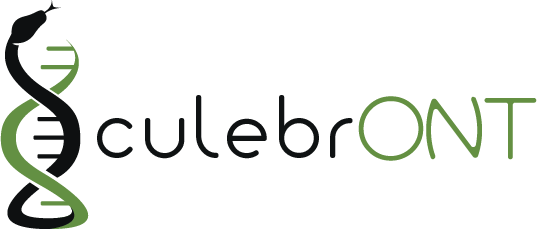

Using data from long reads obtained by Oxford Nanopore Technologies sequencing makes genome assembly easier, in particular to solve repeats and structural variants, in prokaryotic as well as in eukaryotic genomes, resulting in increased contiguity and accuracy.

Bunch of softwares and tools are released or updated every week, and a lot of species see their genome assembled using those.

That’s right.

"*But which assembly tool could give the best results for my favorite organism?*"

**CulebrONT can help you!** CulebrONT is an open-source, scalable, modulable and traceable snakemake pipeline, able to launch multiple assembly tools in parallel and providing help for choosing the best possible assembly between all possibilities.

**Homepage: https://culebront-pipeline.readthedocs.io/en/latest/**

## Citation

@Authors:

Aurore Comte (IRD) and Julie Orjuela (IRD) developped CulebrONT.

Sebastien Ravel (CIRAD), Florian Charriat (CIRAD) helped on SnakeMake bugs and tricks.

François Sabot (IRD) was involved in coverage tools implementation.

Ndomassi Tando (IRD) helped on Singularity containers creation.

Sebastien Cunnac (IRD) and Tram Vi (IRD) tested on real data and helped for circularisation improvements.

## Useful notes

Before launching CulebrONT, you could base-calling of arbitrarily multiplexed libraries across several Minion runs with sequencing quality control and gather the output files by genome for subsequent steps. For that use https://github.com/vibaotram/baseDmux.

#### Thanks

The authors acknowledge the IRD i-Trop HPC (South Green Platform) at IRD Montpellier for providing HPC resources that have contributed to this work. https://bioinfo.ird.fr/ - http://www.southgreen.fr

Thanks to Yann Delorme for this beautiful logo https://nimarell.github.io/resume

## License
Licencied under CeCill-C (http://www.cecill.info/licences/Licence_CeCILL-C_V1-en.html) and GPLv3
Intellectual property belongs to IRD and authors.
