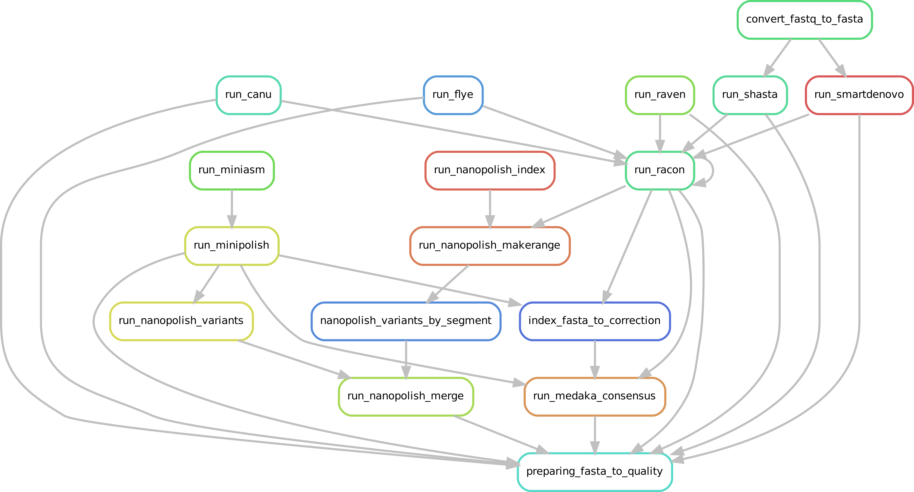
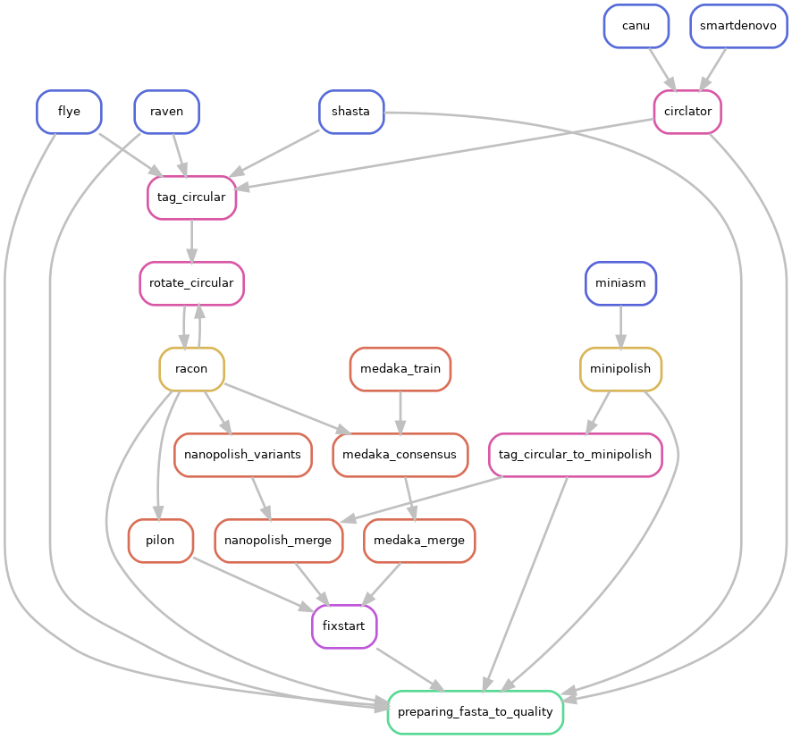

.. image:: _images/culebront_logo.png
   :target: _images/culebront_logo.png
   :align: center
   :alt: Culebront Logo

Today, assembly a genome using long reads from either Oxford Nanopore Technologies or Pacific Biosciences is really powerful, in particular to solve repeats and structural variants, for prokaryotic as well as for eukaryotic genomes. Such technologies provide assemblies that are increased in contiguity and accuracy.

Due to the daily deluge of data sequences and the increasing number of released tools that are even updated every week, many species see having their genome assembled in almost chromosome-scale, and that’s great...

However a huge question remains:

*"But which assembly tool will provide the best result for your favorite organism?"*

To that anguishing idea, we can answer: **CulebrONT can help you!**

CulebrONT is an open-source, scalable, modular and traceable *Snakemake* pipeline, able to launch multiple assembly tools in parallel, giving you the possibility of circularise, polish, and correct assemblies, in addition to perform quality controls. CulebrONT can help to choose the best assembly pipeline between all possibilities.

Assembly, circularisation, polishing and correction steps are all included within CulebrONT, and can be activated (or not) according to user’s requests. The most commonly used tools in the community for each of these steps are integrated, as well as many quality control tools. CulebrONT also generates a report compiling information obtained at each step, to help user to decide which assembly pipeline results to work with.

.. contents:: Table of Contents
   :depth: 2
   :backlinks: entry

From assembly to correction
---------------------------

CulebrONT is a really flexible tool to assemble, circularise (or not), polish and correct assemblies. You can give your own parameters in the *config.yaml* file to CulebrONT to generate a modular, dedicated pipeline for your own data.
   
.. warning::
   You must launch at least one of the assemblers included in CulebrONT to pipe it with the potential circularisation, polishing and correction steps or with the quality control pipeline.

Assembly
........

CulebrONT includes (for the moment) six recent and community-validated assemblers :

* Flye version >= 2.6 https://github.com/fenderglass/Flye
* Canu version >= 2.0 https://canu.readthedocs.io/en/latest/quick-start.html
* Miniasm version >= 0.3 https://github.com/lh3/miniasm + Minipolish version >= 0.1.2 https://github.com/rrwick/Minipolish
* Shasta version 0.5.1 https://github.com/chanzuckerberg/shasta
* Smartdenovo version 1.0.0 https://github.com/ruanjue/smartdenovo
* Raven version >= 1.2.2 https://github.com/lbcb-sci/raven

Optional circularisation
........................

You can activate or deactivate circularisation steps; if you are interested on eukaryotic organims, circularisation is not necessary, then switch to *CIRCULAR=False* in the ``config.yaml``  file.

Directed acyclic graphs (DAGs) show the differences between deactivated (CIRCULAR=False):

and activated CIRCULAR step on configuration file (CIRCULAR=True):

If an assembled molecule is circular, e.g. for bacterial genome, this molecule is tagged and will be treated in a special way in the pipeline. We implemented tagging and rotation of circular molecule before each polishing step, and we fixing start position on circular genome. This is efficient when multiple genome alignments are envisaged.

.. note::
   * If circular step is activated, the *--plasmids* option on Flye is automatically set up.
   * *Circlator* is used to circularise assemblies from Canu and Smartdenovo. Circlator will attempt to identify each circular sequence and output a linearised version for each of them.
   * During the circularisation step performed by Circlator, trimmed corrected fastq files obtained by Canu are used by Circlator. Raw fastq files are used directly for other assemblers.
   * Circularisation for Miniasm is performed by minipolish.
   * Circularisation for Miniasm, Raven and Shasta is checked using generated GFA files on a special tag_circular step, tagging circular fasta sequences.

**OPTIONAL FIXING START**

Only if the circular step is TRUE, a fixstart step is performed before the quality control. This step uses Circlator with the option *fixstart* to rotate circular sequences. Rotation is done using the dnaA start gene (if found). This is important when multiple alignments are envisaged.

Fixstart is always performed on the last draft sequenced obtained in the pipeline. In others words:

.. note::
   * Fixstart is launched after the assembly step if only assembly is activated.
   * Fixstart is launched after the polishing step if assembly+polishing are activated.
   * Fixstart is launched after the correction step if assembly+polishing+correction or assembly+correction are activated

.. warning::
   In any case, Fixstart will be deactivated if CIRCULAR is set to False

Included tools :

* Circlator version >= 1.5.2 https://github.com/sanger-pathogens/circlator

Polishing
.........

Polishing step is ensured by Racon, that corrects raw contigs generated by rapid assembly methods with the original long reads (generally ONT). Choose how many rounds of Racon you want to perform (constrains from 1 to 9 rounds), and CulebrONT will recursively do it for you. Generally 2 to 4 iterations are the best choices.

.. note::
   * Minipolish includes a Racon polishing round, so if polishing is deactivated for the other assemblers (Flye, Shasta, Raven, Smartdenovo and Canu), Miniasm will still polish anyway. Please take it into account when you are doing pipeline comparisons.
   * Raven parameter -p (for polishing) is by default of 0.
   * A control rotation of circular molecule is performed before every Racon step.

Included tools :

* Racon version >= 1.4.13 https://github.com/isovic/racon

Correction
..........

Correction can improve the consensus sequence for a draft genome assembly coming from ONT data, thus we include *Nanopolish* and *Medaka* as possible correction steps. In addition to simple correction, you can train a Medaka model and use it directly to obtain a consensus from your favorite organism.

.. note::
   * We included segment splitting of the assembled molecules before Nanopolish and Medaka.
   * Each segment is polished in parallel to improve speed and save time.
   * Polished segments are merged subsequently.
   * CulebrONT implemented parallelism following the `Medaka documentation <https://nanoporetech.github.io/medaka/installation.html#improving-parallelism>`_ and the `Nanopolish practices <https://nanopolish.readthedocs.io/en/latest/quickstart_consensus.html#compute-a-new-consensus-sequence-for-a-draft-assembly>`_.

**If you have short reads, you can now use *Pilon* to correct assemblies. As for Racon, several recursive rounds of Pilon can be run.**

Included tools :

* Medaka Medaka-gpu version >= 1.2 https://github.com/nanoporetech/medaka
* Nanopolish version >= 0.13.2 https://nanopolish.readthedocs.io/en/latest/index.html#
* Pilon version >= 1.24 https://github.com/broadinstitute/pilon/releases/

Quality Control of assemblies
-----------------------------

A variety of useful tools are implemented to check the accuracy of assemblies.

.. image:: _images/schema_pipeline_global-QUALITY.png
   :target: _images/schema_pipeline_global-QUALITY.png
   :alt: QUALITY

CulebrONT checks the quality of the assemblies with using these optional tools:

.. note::
   * BUSCO: helps to check if you have a good assembly, by searching the expected single-copy lineage-conserved orthologs in any newly sequenced genome from an appropriate phylogenetic clade.
   * QUAST: a good starting point to evaluate the quality of assemblies, provides many helpful contiguity statistics and metrics.
   * Blobtools: allows to detect contamination on assembled contigs as well as GC% or depth biases.
   * Assemblytics: compares structural variations of assemblies versus a reference genome
   * KAT: explores k-mers frequencies and checks for possible contamination
   * Samtools flagstats: calculates remapping stats using Illumina reads over assemblies
   * Mauve: allows multiple alignment of several assembles (for small genome only)
   * Merqury: Evaluate assembly quality with the the k-mer spectrum of an illumina read set

.. danger::
   Please, activate Mauve only for small genomes.

Included tools :

* BUSCO version >= 4.0.5
* QUAST version >= 5.0.2
* Bloobtools version >= 1.1.1
* Assemblytics version >= 1.2
* KAT version >= 2.4.2
* Samtools version>= 1.10
* Mauve > 2.4.0.snapshot_2015_02_13
* Merqury >= 1.3
