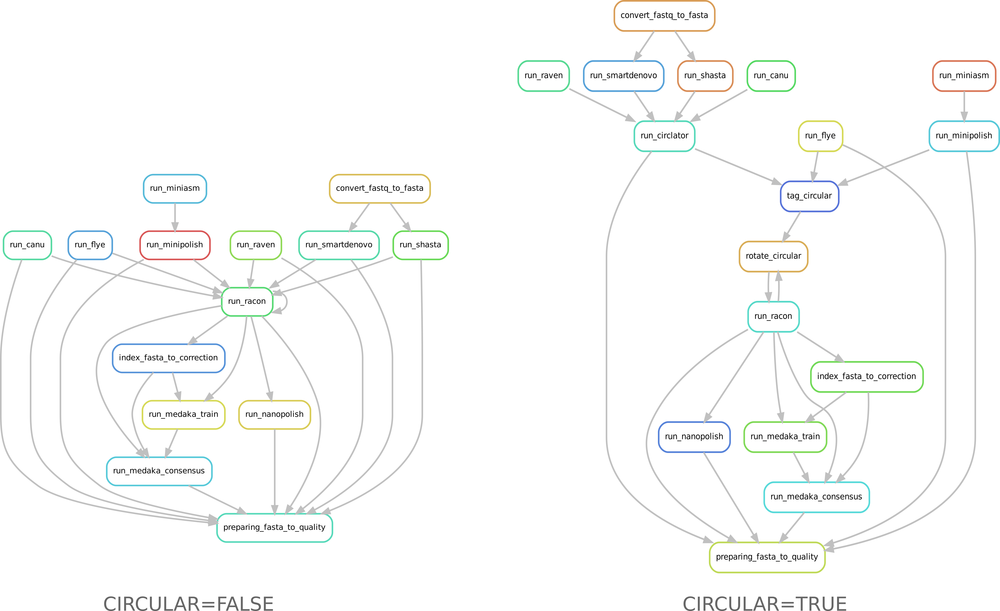
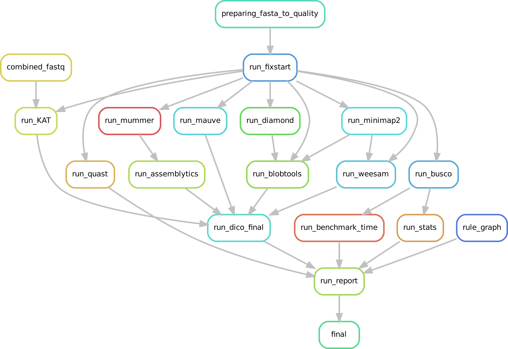

Assembly, circularisation, polishing and correction steps are included in CulebrONT, and can be activated (or not) according to user’s requests. The most commonly used tools in the community for each step are integrated, as well as various quality control tools. CulebrONT also generates a report compiling information obtained at every step.

From assembly to correction
---------------------------

CulebrONT is really flexible to assembly and circularise (or not) assembled molecules, polish and correct assemblies.

For assemblies, you must launch at least one of assemblers included in CulebrONT and pipe assembly with circularisation, polishing and correction steps as well as with the quality control pipeline.

For circularisation, you can activate/deactivate circularisation steps if needed.
If you are interested on eukaryotic organims, thus circularisation is not necessary use CIRCULAR=False on *config.yaml* file.

Directed acyclic graphs (DAGs) show the differences between deactivated (left) and activated (right) CIRCULAR step on configuration file.

Assembly
^^^^^^^^

CulebrONT includes (at the moment) three recent and community-validated assemblers : Flye, Miniasm and Canu. More will be added in the future.

Included tools :

* Flye version >= 2.6 https://github.com/fenderglass/Flye
* Canu version >= 1.9 https://canu.readthedocs.io/en/latest/quick-start.html
* Miniasm version >= 0.3 https://github.com/lh3/miniasm + Minipolish version >= 0.1.2 https://github.com/rrwick/Minipolish

Circularisation
^^^^^^^^^^^^^^^

If an assembled molecule is circular, e.g. for bacteria (CIRCULAR=True), this molecule is tagged and will be treated specially in pipeline. We implemented tagging and rotation of circular molecule before each racon polishing step, and we fixing start position on circular genome. This is efficient when multiple genome alignments are envisaged.

* If Circularisation (CIRCULAR=True) step is choosen, the *--plasmids* option on Flye is activated.
* *Ciclator* is used to circularise assembly from Canu. Circlator will attempt to identify each circular sequence and output a linearised version from each of them.
* Circularisation for Miniasm is already performed by minipolish.

Included tools :

* Circlator version >= 1.5.5 https://github.com/sanger-pathogens/circlator

Polishing
^^^^^^^^^

Polishing step is ensured by Racon. Racon corrects raw contigs generated by rapid assembly methods with original ONT reads. Choose how many rounds of Racon you want to perform (constrains from 1 to 9 rounds), and CulebrONT will recursively do it for you. Generally 3 or 4 iterations are the best choices.

Included tools :

* Racon version >= 1.4.3 https://github.com/isovic/racon

Correction
^^^^^^^^^^

Correction can improve the consensus sequence for a draft genome assembly. We include Nanopolish and Medaka on correction steps. With CulebrONT you can now train a Medaka model and use it directly to obtain a consensus from you favorite organism. In addition, Medaka can use a dedicated GPU resource if indicated.

Included tools :s

* Medaka Medaka-gpu version >= 1.0.3 https://github.com/nanoporetech/medaka
* Nanopolish version >= 0.11.3 https://nanopolish.readthedocs.io/en/latest/index.html#

Checking assembly quality
-------------------------

A variety of useful tools exist for check high accuracy assembly.

Mandatory Quality tools
^^^^^^^^^^^^^^^^^^^^^^^

 In CulebrONT, BUSCO and QUAST are selected by default. BUSCO helps to check if you have a good assembly, by searching the expected single-copy lineage-conserved orthologs in any newly-sequenced genome from an appropriate phylogenetic clade. QUAST is a good starting point to help evaluate the quality of assemblies, providing many helpful contiguity statistics. BUSCO and QUAST statistics are summarized in the CulebrONT final report.

* BUSCO and QUAST statistics will be calculated by acivaiting the QUALITY (ASSEMBLY, POLISHING, CORRECTION) steps. You must activate at least one over three QUALITY options on *config.yaml* file.

Included tools :

* BUSCO version >= 4.0.5
* QUAST version >= 5.0.2

Optional Quality tools
^^^^^^^^^^^^^^^^^^^^^^

CulebrONT checks also the quality of assemblies by using Bloobtools, Assemblytics or KAT, or any combination of these. Weesam can be also used to check read coverage over you assembly (for small genome only). Alignment of several assembles (or from any steps : assembly, polishing, correction) and there comparison is performed using Mauve (for small genome only).

Included tools :

* Bloobtools version >= 1.1.1
* Assemblytics version >= 1.2
* KAT version >= 2.4.1
* Weesam version > 1.6
* Mauve > 2.4.0.snapshot_2015_02_13

Output report
^^^^^^^^^^^^^

CulebrONT generates a report presenting the summary statistics from different steps of the pipeline.

This report has different dependencies to be preinstalled, as recomanded in the `installation step <#installation>`_

Don't worry if you do not have access to all these depedencies !! The whole packages used in the report are available in  the *R.def* Singularity image, available at the Singularity hub or build from the `CulebrONT Containers repository <https://github.com/SouthGreenPlatform/CulebrONT_pipeline/tree/master/Containers>`_ (only if you have sudo super cowpowers).
