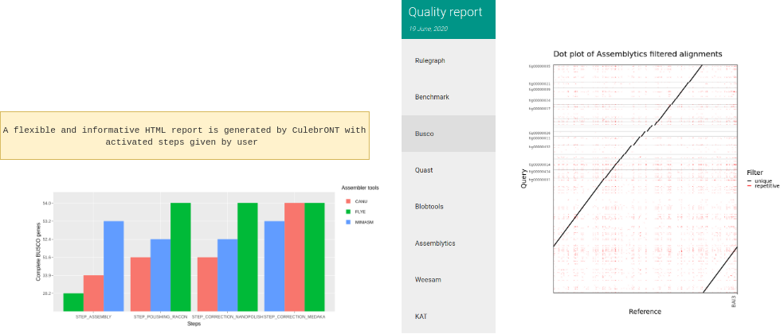

**For IRD iTrop or IFB HPC resources users ONLY**

.. code-block:: bash

   # On i-Trop HPC
   module load system/singularity/3.3.0
   module load system/python/3.7.2

   # On IFB HPC
   module load singularity
   module load python/3.7
   module load graphviz/2.40.

Prepare config.yaml
-------------------

To run the pipeline you have to provide the data path and activate/deactivate options in every step from config.yaml file.

1. Providing data
^^^^^^^^^^^^^^^^^

First, indicate the data path in the configuration file

.. code-block:: yaml

   DATA:
       FASTQ: '/path/to/fastq/directory/'
       REF: '/path/to/referencefile.fasta'
       GENOME_SIZE: '1m'
       FAST5: '/path/to/fast5/directory/'
       ILLUMINA: '/path/to/illumina/directory/'
       OUTPUT: '/path/to/output/directory/'
       CIRCULAR : True/False

*
  **FASTQ**\ : CulebrONT takes as input a FASTQ directory. Every FASTQ file should contain the whole set of reads to be assembled (meaning that multiple runs must be merged in a single FASTQ file), as each FASTQ file found in this repertory will be assembled independently. FASTQ files can be compressed or not (gzipped). Naming convention accepted by CulebrONT are: *NAME.fastq.gz* or *NAME.fq.gz* or *NAME.fastq* or *NAME.fq*.

*
  **REF**\ : Only one REFERENCE genome file will be used by CulebrONT. This REFERENCE will be used for QC steps (QUAST and MAUVE).

*
  **GENOME_SIZE** : Estimated genome size (m,g,k) of the assembly.

*
  **FAST5**\ : Nanopolish needs FAST5 files to training steps. Please give the path of FAST5 repertory in the *FAST5* DATA parameter. Inside this directory, a subdirectory with the exact same name as the corresponding FASTQ (before the *.fastq.gz*\ ) is requested. For instance, if in the *FASTQ* directory we have *run1.fastq.gz* and *run2.fastq.gz*\ , CulebrONT is expecting the *run1/* and *run2/* subdirectories in the FAST5 main directory.

*
  **ILLUMINA** : indicate the path to the directory with *Illumina* sequence data (in fastq or fastq.gz format) to perform KAT quality. Use preferentially paired-end data.

*
  **OUTPUT**\ : output *path* directory.

*
  **CIRCULAR** : Indicate *True* or *False* to activate/deactivate circularisation steps (only to procaryote).

2. Chose assemblers, polisher and correctors
^^^^^^^^^^^^^^^^^^^^^^^^^^^^^^^^^^^^^^^^^^^^

Activate/deactivate assemblers and correctors as you wish. By default, Racon is launched as POLISH tool after each activated assembly step. You **must** activate at least one assembler and one corrector.

Example:

.. code-block:: yaml

   ASSEMBLY:
       CANU : False
       FLYE : True
       MINIASM : False
       SHASTA : False
       SMARDENOVO : True
       RAVEN: True
   CORRECTION:
       NANOPOLISH : True
       MEDAKA : False

3. Chose quality tools
^^^^^^^^^^^^^^^^^^^^^^

Activate/deactivate quality tools as you wish. By default, BUSCO AND QUAST are launched if 'True' in QUALITY (ASSEMBLY OR POLISHING OR CORRECTION OR both) steps.

 You **must** to activate at least one QUALITY step.

 Example:

.. code-block:: yaml

   QUALITY:
       ASSEMBLY : True
       POLISHING : True
       CORRECTION : True

Others quality tools are launched only on the *final assemblies* (BLOBTOOLS, ASSEMBLYTICS, WEESAM and KAT).

KAT quality tool can be activate but Illumina reads are mandatory in this case.

.. code-block:: yaml

   #### Others quality tools
       FIXSTART: True
       WEESAM: True
       BLOBTOOLS: True
       ASSEMBLYTICS: True
       KAT: True

* Alignment of various assemblies **for small genomes (<10-20Mbp)** is also possible by using Mauve. Mauve will compared assembly activated on QUALITY key (ASSEMBLY and/or POLISHING and/or CORRECTION) for each assembler used.
* Before launch Mauve MSA to improve alignment on circular molecules is recommended to activate *Fixstart* step.
* In any case, Fixstart will be deactivated if CIRCULAR is False
* Only activate MAUVE if you have more than one sample and more than one quality step.

.. code-block:: yaml

   MSA:
       MAUVE: True

4. Parameters for some specific tools
^^^^^^^^^^^^^^^^^^^^^^^^^^^^^^^^^^^^^

Specifically to Racon:

* Racon can be launch recursively from 1 to 9 rounds. 2 or 3 are recommended.

Specifically to Medaka :

* If 'MEDAKA_TRAIN_WITH_REF' is activated, Medaka launchs training using the reference found in 'DATA/REF' param. Medaka does not take into account other medaka model parameters.
* If 'MEDAKA_TRAIN_WITH_REF' is deactivated, Medaka does not launch training but uses instead the model provided in 'MEDAKA_MODEL_PATH'. If 'MEDAKA_MODEL_PATH' is empty, this param is not used and the default model for *E.coli* is used.

Standard parameters used:

.. code-block:: yaml

    ############ PARAMS ################
    params:
        MINIMAP2:
            PRESET_OPTION: 'map-pb' # -x minimap2 preset option is map-pb by default (map-pb, map-ont etc)
        FLYE:
            OPTIONS: ''
        CANU:
            MAX_MEMORY: '15G'
            OPTIONS: '-fast'
        SMARTDENOVO:
            KMER_SIZE: 16
            OPTIONS: '-J 5000'
        SHASTA:
            MEM_MODE: 'filesystem'
            MEM_BACKING: 'disk'
        CIRCLATOR:
            OPTIONS: ''
        RACON:
            RACON_ROUNDS: 2 #1 to 9
        NANOPOLISH:
            # segment length to split assembly and correct it  default=50000
            NANOPOLISH_SEGMENT_LEN: '50000'
            # overlap length between segments  default=200
            NANOPOLISH_OVERLAP_LEN: '200'
            OPTIONS: ''
        MEDAKA:
            # if 'MEDAKA_TRAIN_WITH_REF' is True, medaka launchs training using reference found in DATA REF param. Medaka does not take in count other medaka model parameters below.
            MEDAKA_TRAIN_WITH_REF: True
            MEDAKA_MODEL_PATH: 'medakamodel/r941_min_high_g303_model.hdf5' # if empty this param is forgotten.
            #options to feature, train and consensus
            MEDAKA_FEATURES_OPTIONS: '--batch_size 100 --chunk_len 10000 --chunk_ovlp 1000'
            MEDAKA_TRAIN_OPTIONS: '--batch_size 100 --epochs 5000 '
            MEDAKA_CONSENSUS_OPTIONS: '-b 50 --hint=nomultithread' #use multithread on cluster
        BUSCO:
            DATABASE : 'Data-Xoo-sub/bacteria_odb10'
            MODEL : 'genome'
            SP : ''
        QUAST:
            REF: 'Data-Xoo-sub/ref/BAI3_Sanger.fsa'
            GFF: ''
            GENOME_SIZE_PB: 48000000
            #GENOME_SIZE_PB: 1000000
            OPTIONS : ''
        DIAMOND:
            DATABASE: 'Data-Xoo-sub/testBacteria.dmnd'
        MUMMER:
            #  -l default 20
            MINMATCH : 100
            # -c default 65
            MINCLUSTER: 500
        ASSEMBLYTICS:
            UNIQUE_ANCHOR_LEN: 10000
            MIN_VARIANT_SIZE: 50
            MAX_VARIANT_SIZE: 10000

Singularity containers
~~~~~~~~~~~~~~~~~~~~~~

To use Singularity containers, provide to CulebrONT the already build Singularity containers path on your computer or cluster.

As an example, here are singularity images found  on the i-Trop HPC from the SouthGreen platform.

.. code-block:: yaml

   # cluster with scratch temporary directory
   SCRATCH = False

   ## @ITROP PATH
   tools:
   ## ASSEMBLERS:
       CANU_SIMG : '/data3/projects/containers/CULEBRONT/canu-1.9.simg'
       FLYE_SIMG : '/data3/projects/containers/CULEBRONT/flye-2.7.1.simg'
       MINIASM_SIMG : '/data3/projects/containers/CULEBRONT/miniasm-0.3.simg'
       MINIPOLISH_SIMG : '/data3/projects/containers/CULEBRONT/minipolish-0.1.2.simg'
       RAVEN_SIMG : '/data3/projects/containers/CULEBRONT/raven_conda-gpu-v1.1.10.simg'
       SMARTDENOVO_SIMG : '/data3/projects/containers/CULEBRONT/smartdenovo.simg'
       SHASTA_SIMG : '/data3/projects/containers/CULEBRONT/shasta-0.5.1.simg'
   ## CIRCULARISATION
       CIRCLATOR_SIMG : '/data3/projects/containers/CULEBRONT/circlator-1.5.5.simg'
   ## POLISHERS:
       RACON_SIMG : '/data3/projects/containers/CULEBRONT/racon-1.4.3.simg'
       NANOPOLISH_SIMG : '/data3/projects/containers/CULEBRONT/nanopolish-0.11.3.simg'
   ## CORRECTION
       MEDAKA_SIMG : '/data3/projects/containers/CULEBRONT/medaka_conda-gpu-1.0.3.simg'
   ## QUALITY
       BUSCO_SIMG : '/data3/projects/containers/CULEBRONT/busco-4.0.5.simg'
       QUAST_SIMG : '/data3/projects/containers/CULEBRONT/quast-5.0.2.simg'
       WEESAM_SIMG : '/data3/projects/containers/CULEBRONT/weesam.simg'
       BLOBTOOLS_SIMG : '/data3/projects/containers/CULEBRONT/bloobtools-v1.1.1.simg'
       MINIMAP2_SIMG: '/data3/projects/containers/CULEBRONT/nanopolish-0.11.3.simg'
       DIAMOND_SIMG : '/data3/projects/containers/CULEBRONT/diamond-0.9.30.simg'
       MUMMER_SIMG : '/data3/projects/containers/CULEBRONT/mummer-4beta.simg'
       ASSEMBLYTICS_SIMG : '/data3/projects/containers/CULEBRONT/assemblytics-1.2.simg'
       SAMTOOLS_SIMG : '/data3/projects/containers/CULEBRONT/nanopolish-0.11.3.simg'
       KAT_SIMG : '/data3/projects/containers/CULEBRONT/kat-2.4.2.simg'
       MINICONDA_SIMG : 'shub://vibaotram/singularity-container:cpu-guppy3.4-conda-api'
       R_SIMG: '/data3/projects/containers/CULEBRONT/R.simg'

Available recipes from containers are available in the *Containers* folder, as well as on the main `CulebrONT repository <https://github.com/SouthGreenPlatform/CulebrONT.git>`_. Feel free to build them on your own computer (or cluster); be careful, you need root rights to do it.

Built singularity images are also available on https://itrop.ird.fr/culebront_utilities/. Feel free to download it using ``wget`` for example.

singularity hub
###############

If you want to recover singularity images from the Singularity Hub and build them, please use these paths :

.. code-block:: yaml

   # cluster with scratch temporal repertory
   SCRATCH : False

   tools:
   ###### ASSEMBLERS:
         CANU_SIMG: 'shub://SouthGreenPlatform/CulebrONT_pipeline:canu-1.9.def'
         FLYE_SIMG: 'shub://SouthGreenPlatform/CulebrONT_pipeline:flye-2.6.def'
         MINIASM_SIMG : 'shub://SouthGreenPlatform/CulebrONT_pipeline:miniasm-0.3.def'
         MINIPOLISH_SIMG : 'shub://SouthGreenPlatform/CulebrONT_pipeline:minipolish-0.1.2.def'
         RAVEN_SIMG : 'shub://SouthGreenPlatform/CulebrONT_pipeline:raven_conda-gpu-v1.1.10.simg'
         SMARTDENOVO_SIMG : 'shub://SouthGreenPlatform/CulebrONT_pipeline:smartdenovo.simg'
         SHASTA_SIMG : 'shub://SouthGreenPlatform/CulebrONT_pipeline:shasta-0.5.1.simg'
   ###### CIRCULARISATION
         CIRCLATOR_SIMG : 'shub://SouthGreenPlatform/CulebrONT_pipeline:circlator-1.5.5.def'
   ###### POLISHERS:
         RACON_SIMG : 'shub://SouthGreenPlatform/CulebrONT_pipeline:racon-1.4.3.def'
   ###### CORRECTION
         NANOPOLISH_SIMG : 'shub://SouthGreenPlatform/CulebrONT_pipeline:nanopolish-0.11.3.def'
         MEDAKA_SIMG : 'shub://SouthGreenPlatform/CulebrONT_pipeline:medaka_conda-gpu-1.0.3.simg'
   ###### QUALITY
         BUSCO_SIMG : 'shub://SouthGreenPlatform/CulebrONT_pipeline:busco-4.def'
         QUAST_SIMG : 'shub://SouthGreenPlatform/CulebrONT_pipeline:quality.def'
         WEESAM_SIMG : 'shub://SouthGreenPlatform/CulebrONT_pipeline:quality.def'
         BLOBTOOLS_SIMG : 'shub://SouthGreenPlatform/CulebrONT_pipeline:quality.def'
         MINIMAP2_SIMG: 'shub://SouthGreenPlatform/CulebrONT_pipeline:nanopolish-0.11.3.simg'
         DIAMOND_SIMG : 'shub://SouthGreenPlatform/CulebrONT_pipeline:quality.def'
         MUMMER_SIMG : 'shub://SouthGreenPlatform/CulebrONT_pipeline:mummer-4beta.def'
         ASSEMBLYTICS_SIMG : 'shub://SouthGreenPlatform/CulebrONT_pipeline:quality.def'
         SAMTOOLS_SIMG : 'shub://SouthGreenPlatform/CulebrONT_pipeline:nanopolish-0.11.3.simg'
         KAT_SIMG : 'shub://SouthGreenPlatform/CulebrONT_pipeline:quality.def'
         MINICONDA_SIMG: 'shub://vibaotram/singularity-container:cpu-guppy3.4-conda-api'
         R_SIMG: 'shub://SouthGreenPlatform/CulebrONT_pipeline:r.def'

Launching on a single machine
---------------------------------------

To launch CulebrONT on a single machine, you should use the parameters ``--use-singularity`` and ``--use-conda``.

See the example below:

.. code-block::

   snakemake -s Snakefile --configfile config.yaml --use-singularity  --use-conda --latency-wait 120

Launching on HPC clusters
-----------------------------------

Preparing Slurm cluster configuration using cluster_config.yaml
^^^^^^^^^^^^^^^^^^^^^^^^^^^^^^^^^^^^^^^^^^^^^^^^^^^^^^^^^^^^^^^

On ``cluster_config.yaml``\ , you can add partition, memory and threads to be used by default for each rule. If more memory or threads are requested, please adapt the content of this file before running on a cluster for every rule. For instance give more memory to Canu and Medaka.

 Here is a example of the configuration file we used on the i-Trop HPC.

.. code-block:: yaml

   __default__:
       cpus-per-task : 4
       ntasks : 1
       mem-per-cpu : '2'
       partition : "normal"
       output : 'logs/stdout/{rule}/{wildcards}'
       error : 'logs/error/{rule}/{wildcards}'
   #
   #run_nanopolish :
   #    cpus-per-task : 8
   #    mem-per-cpu : '4'
   #    partition : "long"
   #
   run_canu:
       cpus-per-task : 8
       mem-per-cpu : '4'
       partition : "long"

submit_culebront.sh
^^^^^^^^^^^^^^^^^^^

This is a typical launcher for using CulebrONT on a Slurm cluster. You have to adapt it for the configuration of your favorite cluster.
Please adapt this script also if you want to use wrappers or profiles.

.. code-block::

   #!/bin/bash
   #SBATCH --job-name culebrONT
   #SBATCH --output slurm-%x_%j.log
   #SBATCH --error slurm-%x_%j.log

   module load system/singularity/3.3.0
   module load system/python/3.7.2

   snakemake --unlock

   # SLURM JOBS WITH USING WRAPPER
   snakemake --nolock --use-conda --use-singularity --cores -p --verbose -s Snakefile \
   --latency-wait 60 --keep-going --restart-times 1 --rerun-incomplete  \
   --configfile config.yaml \
   --cluster "python3 slurm_wrapper.py config.yaml cluster_config.yaml" \
   --cluster-config cluster_config.yaml \
   --cluster-status "python3 slurm_status.py"

   # USING PROFILES
   #snakemake --nolock --use-singularity --use-conda --cores -p --verbose -s Snakefile --configfile config-itrop.yaml \
   #--latency-wait 60 --keep-going --restart-times 1 --rerun-incomplete --cluster-config cluster_config.yaml --profile slurm-culebrONT

This launcher can be submitted to the Slurm queue typing:

.. code-block::

   sbatch submit_culebront.sh

*Important* : Do not forget to adapt submit_culebront.sh if you want to use wrappers or profile!!

slurm_wrapper
^^^^^^^^^^^^^

A slurm_wrapper.py script is available on CulebrONT projet to manage ressources from your cluster configuration (taken from cluster_config.yaml file).
This is the easier way to know what is running on cluster and to adapt ressources for every job. Take care, this cluster_config.yaml file is becomming obsolete on next Snakemake versions.

Profiles
~~~~~~~~

Optionally is possible to use Profiles in order to run CulebrONT on HPC cluster. Please follow the `recommendations found on the SnakeMake profile github <https://github.com/Snakemake-Profiles/>`_.

Here is an example of how to profile a Slurm scheduler using `those recommandations <https://github.com/Snakemake-Profiles/slurm>`_.

.. code-block::

   $ mkdir -p ~/.config/snakemake
   $ cd ~/.config/snakemake
   $ pip install --user cookiecutter
   $ cookiecutter https://github.com/Snakemake-Profiles/slurm.git
   # Answer to questions :
   profile_name [slurm]: slurm-culebrONT
   sbatch_defaults []:
   cluster_config []: cluster_config.yaml
   Select advanced_argument_conversion:
   1 - no
   2 - yes
   Choose from 1, 2 [1]: 2

   $ cp /shared/home/$USER/CulebrONT_pipeline/cluster_config.yaml .
   # edit slurm-submit.py and upgrade this dictionary with your Slurm options

   RESOURCE_MAPPING = {
       "cpus-per-task": ("cpus-per-task", "cpu"),
       "partition": ("queue", "partition"),
       "time": ("time", "runtime", "walltime"),
       "mem": ("mem", "mem_mb", "ram", "memory"),
       "mem-per-cpu": ("mem-per-cpu", "mem_per_cpu", "mem_per_thread"),
       "nodes": ("nodes", "nnodes"),
       "error": ("logerror", "e"),
       "output": ("logout", "o")}

SLURM Profile *slurm-culebrONT* is now created on : ``/shared/home/$USER/.config/snakemake/slurm-culebrONT`` repertory

Output on CulebrONT
-------------------

The architecture of CulebrONT output is designed as follows:

.. code-block::

    OUTPUT_CULEBRONT_CIRCULAR/
    ├── SAMPLE-1
    │   ├── AGGREGATED_QC
    │   │   ├── DATA
    │   │   ├── MAUVE_ALIGN
    │   │   └── QUAST_RESULTS
    │   ├── ASSEMBLERS
    │   │   ├── CANU
    │   │   │   ├── ASSEMBLER
    │   │   │   ├── CORRECTION
    │   │   │   ├── FIXSTART
    │   │   │   ├── POLISHING
    │   │   │   └── QUALITY
    │   │   ├── FLYE
    │   │   │   ├── ...
    │   │   ├── MINIASM
    │   │   │   ├── ...
    │   │   ├── RAVEN
    │   │   │   ├── ...
    │   │   ├── SHASTA
    │   │   │   ├── ...
    │   │   └── SMARTDENOVO
    │   │   │   ├── ...
    │   ├── DIVERS
    │   │   └── FASTQ2FASTA
    │   ├── LOGS
    │   └── REPORT
    └── FINAL_REPORT
    ├── SAMPLE-2 ...

Report
------

CulebrONT generates a beautiful report containing, foreach fastq found on input directory, a summary of interesting statistics such as busco, quast and others ones that you will discover!

*Important*\ : To visualise the report created by CulebrONT, transfer the file the *report.html* on your local machine and open it on a navigator.
